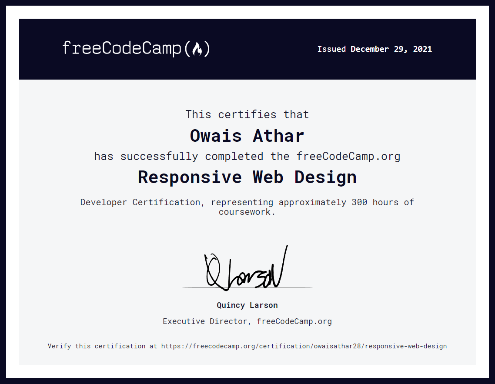

# Portfolio
My Portfolio

[Go to website ↗️](https://owais28.github.io/Portfolio/)

<h3>Navigations</h3>
<ol>
 <li><a href="#certificates">certificates</a></li>
</ol>

<h1 id="certificates">Certificates</h1>

Responsive Web Design - Freecodecamp

[go to original document](https://www.freecodecamp.org/certification/owaisathar28/responsive-web-design)
_(thank you freecodecamp)_

Responsive Web Design - Freecodecamp

[go to original document](https://www.freecodecamp.org/cert)
_(thank you freecodecamp)_
